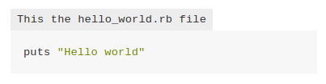
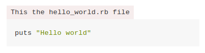

[](LICENSE.md) [](https://badge.fury.io/js/gitbook-plugin-code-captions)

# Gitbook Plugin: Add captions to code snippets

## Description

A simple gitbook plugin for adding captions or titles to code blocks.

This plugin is based on [gitbook-plugin-codeblock-filename](https://www.npmjs.com/package/gitbook-plugin-codeblock-filename).

## Installation

Add the plugin to your `book.json`:

```json
{
	"plugins": [ "code-captions" ]
}
```

Then install it with `gitbook`:

```sh
gitbook install
```

## Usage

Just add a `!CAPTION` sentence before the desired block:

````markdown
!CAPTION This the hello_world.rb file
```ruby
puts "Hello world"
```
````

Generating the following result:



To override the CSS style, include this in your CSS files:

```css
div.code-caption > span.code-caption-text {
  background-color: rgba(255, 0, 0, 0.07);
  /* Your css rules */
}
```

Generating the following result:



## Contributors

This project has been developed by:

| Avatar | Name | Nickname | Email |
| ------ | ---- | -------- | ----- |
|   | Daniel Herzog | Wikiti | [info@danielherzog.es](mailto:info@danielherzog.es)
